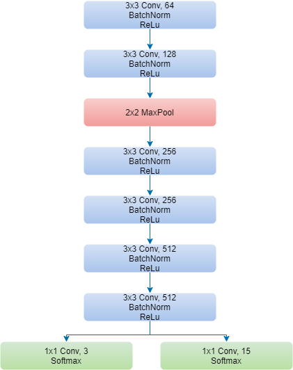

# Invariant Information Clustering for Unsupervised Image Classification and Segmentation

In this blog post we will discuss our reproduction of the model used in [ref]. In particular, we will try to reproduce the
results found in table 4 for the COCO-Stuff-3 dataset. As explained in the paper itself, the COCO-Stuff-3 dataset is the same
dataset as the COCO dataset but only consists of 3 classes, sky, ground and plant. Images that do not contain either of those three
classes are removed from the dataset. Another prerequisite of the image is that it contains at least 75% "stuff pixels".
"Stuff pixels" can be pixels representing anything in the wide range of buildings to bodies of water.
The last criterion is that the image can be shrunk by 2/3 such that later on a crop of 128 by 128 pixels can still be
performed.

## Method

The method used in the paper is novel clustering objective. The method is called Invariant Information Clustering (IIC).
It is a generic clustering algorithm that makes use of unlabeled images to train a randomly initialised neural network.
First we will explain how IIC is used for clustering and afterwards how it is applied for image segmentation.

As input, IIC takes unlabeled training images. The goal is to assign a class label to every training image. The number 
of class labels is a hyperparameter. For training, an image pair is generated for every image by applying a random transformation.
The random transformations consist of color jitter, flips, affine transformations and random crops. The objective then aims to
assign both images from an image pair the same class probabilities.

For image segmentation, we look at individual pixels instead of the full image. Every pixel is assigned class probabilities.
The number of classes is a hyperparameter, which is 3 classes for the COCO-3-stuff dataset. Again, image pairs are generated for training. 
However, the objective now becomes to assign the same class probabilities to corresponding pixels instead of corresponding images. 
The loss is described as maximizing mutual information between the corresponding patches and can be calculated as:

$$
max (\dfrac{1}{n|G||\Omega|} \sum_{i=1}^n \sum_{g \in G} \sum_{u \in \Omega} \Phi_u (x_i) \cdot [g^{-1} \Phi (g x_i)]_{u+t}^T)
$$

The architecture can be seen here. It consists of two convolutional blocks, followed by a max pooling, followed by 4 convolutional blocks.
After that there are two heads which decide the number of output classes. 

To increase the final accuracy, overclustering is used. The second head is added to the network which outputs 15 classes instead of just 3.
The idea is that if the network works better with 15 classes, it will also work better with 3 classes. Every epoch, both heads are trained with all of the data.

__Figure 1: Hi I am a caption.

## Results and Reproduction

The resulting accuracy IIC achieved on COCO-Stuff-3 is 72.3%. The previous highest score was 54%. IIC thus managed to get a
significant increase in the accuracy score, a difference of 18.3%. We worked on trying to reproduce this result. For the dataset,
we performed the exact same operations as the authors to filter the dataset. We ended up with ~40 thousand images while the
authors had ~37 thousand images. There are several explanations which include either a different way of calculating how many
"stuff pixels" remain or the criterion that it can be shrunk. There was, however, no further explanation in the paper on how to
exactly go about the filtering. Since the provided code also did not provide much input (very unreadable), we decided to continue
with ~40 thousand images since a difference of ~3 thousand images is not that much on such a scale.

Once we acquired the data, we continued by reproducing the model. This model was straightforward and can be seen in figure 1.
There was not much trouble setting up the same model and we did that fairly quickly. The training loop consisted of taking a
batch of image pairs. The image pair had to be certain transformations from the original image. These transformations were
horizontal flipping and random colour changes in hue, saturation and brightness. We could not, however, find
how exactly to execute these transformations, i.e. at what percentage to do a horizontal flip.
Since we wanted to reproduce the results as accurately as possible, we looked into the code and used the same numbers for
the transformations. We also used the same loss function and the backwards step from PyTorch [ref] was used.

For the training, we are not able to train it for 4800 epochs due to time constraints. Instead, we trained it for 24 hours. In those 24 hours, we were able to train for

x

epochs. Finally, we were able to achieve an accuracy of

x

%. There are several reason why there is a difference in accuracy. One of the reason is the difference in our network. We did not implement overclustering in our process of training the model. We also did not train the model for the same number of epochs, but since we were already able to achieve an accuracy of

x

%, we believe that each additional epoch would only improve the accuracy by a very small amount. Despite these differences, we believe that the reproduction itself was a success. Judging by the results, however, we do believe that there is improvement to be made. In the paper, the authors gave the images in figure [Z] as results.

[Insert image of tennis court and rail road, Z]

Given that the accuracy is 72.3%, it is hard to believe that all results look the same. Figure [X] shows some really good results outputted from out model.

[Insert image of giraffe and road, X]

However, as one might suspect, it is impossible to have these results but have an accuracy of merely

x

%. That is correct, figure [Y] shows some really bad results from the same model.

[Insert bad results, Y]

## Conclusion

## Future Work?

